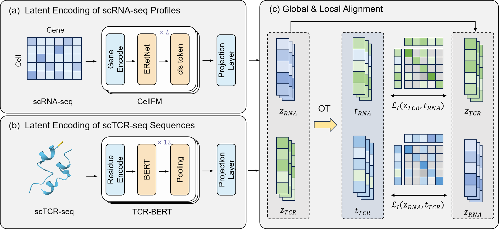

# TransTCR: Integrating TCRs and Transcriptomes through Optimal Transport for Antigen Specificity Prediction

> **TransTCR** is an **unsupervised multimodal representation learning framework** that integrates **single-cell TCR sequencing (scTCR-seq)** and **single-cell RNA sequencing (scRNA-seq)** data through **Optimal Transport (OT)** for **antigen specificity prediction and cell clustering**.



# TransTCR

The official implementation for "**TransTCR**".

**Table of Contents**

- Datasets
- Installation
- Usage

### Datasets

The raw data can be downloaded here:

| Dataset | Download                                                     |
| ------- | ------------------------------------------------------------ |
| D1      | [Link](https://www.10xgenomics.com/cn/datasets/cd-8-plus-t-cells-of-healthy-donor-1-1-standard-3-0-2) |
| D2      | [Link](https://www.10xgenomics.com/cn/datasets/cd-8-plus-t-cells-of-healthy-donor-2-1-standard-3-0-2) |
| D3      | [Link](https://www.10xgenomics.com/cn/datasets/cd-8-plus-t-cells-of-healthy-donor-3-1-standard-3-0-2) |
| D4      | [Link](https://www.10xgenomics.com/cn/datasets/cd-8-plus-t-cells-of-healthy-donor-4-1-standard-3-0-2) |

We provide easy access to the processed datasets in the [Zenodo](https://zenodo.org/records/15493872).

### Installation

To reproduce **TransTCR**, we suggest first creating a conda environment by:

```bash
conda create -n TransTCR python=3.9.21
conda activate TransTCR
```

and then install the required packages below:

- scanpy=1.9.1
- scib=1.1.7
- scipy=1.13.2
- torch=2.6.0
- pot=0.9.5

### Usage

#### Data Preprocessing

To reproduce **TransTCR**, paired scTCR-seq and scRNA-seq data in `h5ad` and `csv` formats must be processed.

- **Process scTCR-seq Data**

We use the pre-trained **TCR-BERT** to encode CDR3 sequences from both TCR chains ([TCR-BERT](https://github.com/wukevin/tcr-bert) must be downloaded separately):

```bash
cd Process/TCR
bash get_emb.sh
```

- **Process scRNA-seq Data**

We employ **CellFM**, a recently published foundational model for single-cell data, to process scRNA-seq data ([CellFM](https://github.com/biomed-AI/CellFM) must be downloaded separately).

#### Train and Evaluate

- Train and evaluate on **intra-dataset** classification and clustering:

```
bash run_Intra.sh
```

- Train and evaluate  on **inter-dataset** classification and clustering:

```
bash run_Inter.sh
```

#### Citation
If you find our codes useful, please consider citing our work:

```
@article{TransTCR,
  title={TransTCR: Integrating TCRs and Transcriptomes through Optimal Transport for Antigen Specificity Prediction},
  author={Yuansong Zeng, Wenbing Li, Ruipeng Huang, Yuanze Chen,Jinyun Niu, Ningyuan Shangguan, Siyuan He, Yuedong Yang},
  journal={},
  year={2025},
}
```

